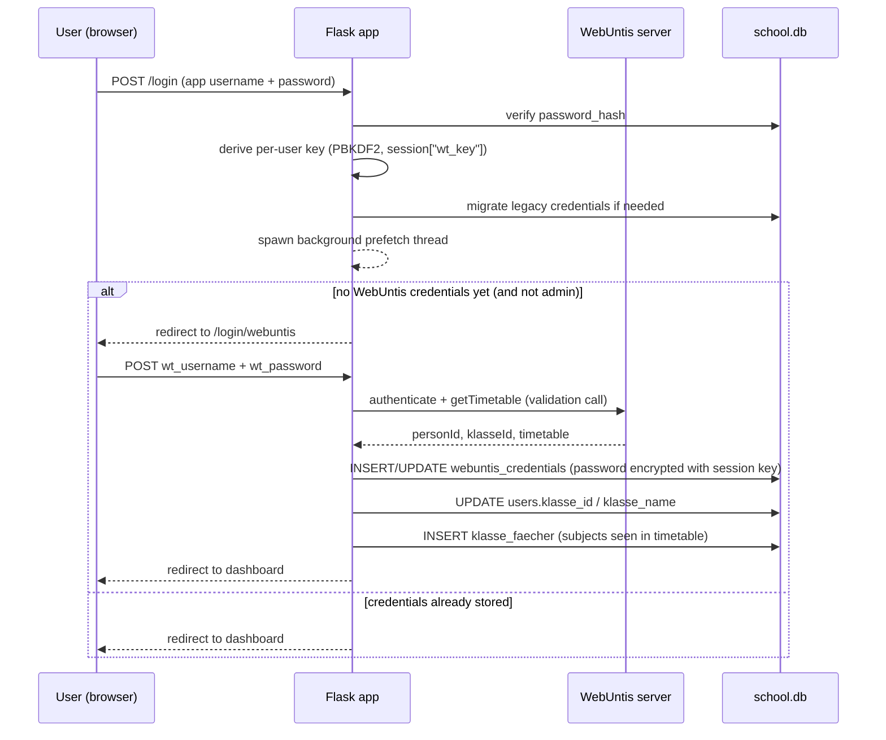

# WebUntis Integration

This document describes how the server talks to WebUntis: the protocol, credential storage and
encryption, caching, and how each feature (timetable, exams, absences, BAföG quota) maps onto
WebUntis API calls.

There is **no third-party WebUntis library** in use (e.g. `python-webuntis`). All communication is a
hand-rolled JSON-RPC 2.0 client plus two undocumented REST endpoints, implemented entirely in
[`core/webuntis_client.py`](../core/webuntis_client.py) using `requests`.

---

## 1. Global vs. per-user configuration

WebUntis credentials have two parts that are configured separately:

| Setting | Scope | Where it's set | Storage |
|---|---|---|---|
| Server hostname + school name | Global, one per installation | **Admin → Settings** ([`routes/admin.py`](../routes/admin.py) `save_webuntis_config`) | `app_settings` table, keys `webuntis_server` / `webuntis_school` |
| WebUntis username + password | Per user | **First login / Profile** ([`routes/auth.py`](../routes/auth.py) `webuntis_setup`, [`routes/profil.py`](../routes/profil.py) `save_webuntis`) | `webuntis_credentials` table, password encrypted |

The `webuntis_credentials` table also has `server`/`school` columns, but they are always saved as
empty strings — they're a schema leftover from before server/school became a global setting. The
actual server/school used at request time always comes from `queries.get_webuntis_config()`
(`app_settings`).

---

## 2. Protocol

### JSON-RPC endpoint

```
POST https://{server}/WebUntis/jsonrpc.do?school={school}
Content-Type: application/json

{"id": "1", "method": "<method>", "params": {...}, "jsonrpc": "2.0"}
```

Implemented by `_rpc()` in [`core/webuntis_client.py:79`](../core/webuntis_client.py). Every public
function opens its own `requests.Session()`, authenticates, makes its calls, and logs out — sessions
are not reused across requests or cached.

Methods used:

| Method | Purpose | Called from |
|---|---|---|
| `authenticate` | Logs in with `user`/`password`/`client`, returns `personId`, `personType`, `klasseId` | every fetch function |
| `getTimegridUnits` | School's period grid (start/end time per period) | `fetch_timetable`, `get_timetable_cached`, `fetch_absences` |
| `getTimetable` | Lesson periods for a date range, `id`+`type` = student or class | `fetch_timetable`, `get_timetable_cached`, `fetch_absences`, `fetch_scheduled_hours` |
| `getSubjects` / `getTeachers` / `getRooms` / `getKlassen` | Lookup tables to resolve IDs → names | `fetch_timetable`, `get_timetable_cached` |
| `logout` | Ends the session (best-effort, errors ignored) | every fetch function |

### REST endpoints (undocumented, browser-facing WebUntis APIs)

| Endpoint | Purpose | Called from |
|---|---|---|
| `GET /WebUntis/api/exams` | Upcoming exams incl. grades | `fetch_exams()` |
| `GET /WebUntis/api/classreg/absences/students` | Absence records | `fetch_absences()` |

These aren't part of the official JSON-RPC API but are the same calls WebUntis' own web client makes;
they're called with the session cookie obtained from the JSON-RPC `authenticate` call.

---

## 3. Credential setup & storage flow

Non-admin users are forced through a one-time WebUntis setup before they can use the app. The
sequence:



Key points:

- The WebUntis password is validated by actually calling `fetch_timetable()` against the real
  WebUntis server before it's ever saved — a wrong password never gets encrypted and stored
  ([`routes/auth.py:203`](../routes/auth.py)).
- On success, the class (`klasseId`/class name) and the set of subjects seen in that week's timetable
  are cached into `users.klasse_id`/`klasse_name` and `klasse_faecher` — this is how subject dropdowns
  and cross-class grade averaging know what subjects exist per class, without a separate admin sync
  step.
- The same save logic is reachable from **Profile → WebUntis** ([`routes/profil.py:64`](../routes/profil.py)
  `save_webuntis`) to change the username/password later, and from **Profile → Delete** to remove
  credentials entirely (`delete_webuntis`, which also clears that user's cache).

---

## 4. Credential encryption

WebUntis passwords are never stored in plaintext or with a single server-wide key. Implemented in
[`core/encryption.py`](../core/encryption.py).

### Per-user key derivation

```python
def derive_key(password: str, salt: bytes) -> bytes:
    dk = hashlib.pbkdf2_hmac("sha256", password.encode("utf-8"), salt, 300_000, dklen=32)
    return base64.urlsafe_b64encode(dk)
```

- Input: the user's **app login password** (not the WebUntis password) + a random 32-byte salt
  unique to that user, stored as hex in `users.wt_key_salt` (created lazily via
  `queries.get_or_create_wt_salt()` on first login).
- PBKDF2-HMAC-SHA256, 300,000 iterations → a Fernet-compatible key.
- The derived key is kept **only in the Flask session** (`session["wt_key"]`), never persisted to
  disk. It is re-derived every login.
- The WebUntis password is encrypted with this key using Fernet (AES-128-CBC + HMAC) and stored in
  `webuntis_credentials.wt_password`.

**Consequence:** a raw database dump alone cannot decrypt any user's WebUntis password — the app
login password (which is only hashed in the DB, per user, and never stored) is also required.

### Password-change re-encryption

When a user changes their app password (`routes/auth.py::change_password`,
`routes/profil.py::change_password`), the WebUntis credential must be re-encrypted with the newly
derived key: the old key (still live in the current session) decrypts the stored ciphertext, then
the plaintext is re-encrypted with the new key and saved. If that fails for any reason, the stored
credentials are deleted rather than left undecryptable, and the user is asked to re-enter them.

### Legacy migration (global `FERNET_KEY`)

Before this per-user scheme existed, all WebUntis passwords were encrypted with a single key from
the `FERNET_KEY` environment variable (`.env`). That variable still exists for backward
compatibility but is only used for **one-time migration**:

- `webuntis_credentials.uses_user_key` marks which scheme a row uses (`0` = legacy, `1` = per-user).
- On every login, `_migrate_credentials()` checks for `uses_user_key = 0` rows belonging to that user,
  decrypts them with `legacy_decrypt()` (the global `FERNET_KEY`), and re-encrypts them with the
  freshly derived per-user key — transparently, in the background, without user interaction.
- If `FERNET_KEY` is missing from the environment on first run, `encryption.py` generates one and
  appends it to `.env` automatically (only needed for migrating pre-existing installs).

---

## 5. Caching

Implemented in [`core/webuntis_client.py`](../core/webuntis_client.py). Every WebUntis read goes
through a cache layer to avoid hammering the school's WebUntis server on every page load.

### Storage

- **Two-tier**: an in-process dict (`_mem`) for speed, backed by a `shelve` (pickle-based key/value
  store) file on disk at `cache/webuntis_cache` (directory overridable via `WEBUNTIS_CACHE_DIR`).
- On process start, `_load_from_disk()` reloads any still-fresh disk entries into memory so a server
  restart doesn't cause a cold cache.
- Writes go to memory first, then best-effort to disk (disk write failures are swallowed so a locked
  file never breaks a request).

### Cache keys

Keys are JSON-serialized tuples, namespaced by data type:

| Data | Key shape |
|---|---|
| Timetable (one week) | `(user_id, monday_iso_date)` |
| Exams | `(user_id, "exams", start_iso, end_iso)` |
| Absences | `(user_id, "absences", start_iso, end_iso)` |
| Scheduled/"Soll" hours | `(user_id, "scheduled", start_iso, end_iso)` |

### TTL and refresh

- `CACHE_TTL = 1800` seconds (30 minutes), the same constant for all data types.
- On a cache **hit within TTL**, no network call happens at all.
- On a cache **miss or stale entry**, the client re-authenticates and re-fetches. If that call fails
  (WebUntis unreachable, credentials rejected, etc.) but a stale cache entry exists, the stale data
  is returned together with a warning string rather than failing the page — this is the "Aktualisierung
  fehlgeschlagen: …" (update failed) message users may see.
- Timetable fetches are range-batched: a single request pulls ±2 weeks (`_RANGE_HALF`) around the
  requested week in one WebUntis session and caches each week separately, so browsing adjacent weeks
  rarely triggers a new network round-trip.
- `fetch_scheduled_hours()` (used for the BAföG quota, which needs a full school year) fetches in
  8-week chunks per request because WebUntis servers commonly cap the date range of a single
  `getTimetable` call.

### Invalidation

- `invalidate_cache(user_id)` — drops all timetable weeks for a user.
- `invalidate_exam_cache(user_id)` / `invalidate_absence_cache(user_id)` — drop just that namespace.
- `clear_all_caches()` — wipes everything (used when the admin changes the global server/school
  config, since old data would point at the wrong instance).
- Each "Refresh" button in the UI (timetable, absences) calls the relevant `invalidate_*` and
  redirects back, forcing a fresh fetch on the next read.

### Prefetch on login

Right after a successful login, `routes/auth.py::login()` spawns a **daemon background thread**
(`_prefetch_webuntis`) that warms the cache for the current week's timetable and the next 180 days
of exams, using the just-derived encryption key. This runs after the login response is already on
its way to the browser, so it doesn't add latency to login — it just means that by the time the user
clicks into the timetable or exam page, the data is often already cached.

---

## 6. Data flows by feature

### Timetable (`/mein-stundenplan`, dashboard highlight)

`get_timetable_cached()` → `fetch_timetable()`-equivalent range fetch → `_build_grid()` assembles a
`{period: {weekday(0-4): slot_or_None}}` grid, where each slot has:

```python
{"fach": "Mathematik", "fach_kurz": "Ma", "lehrer": "Müller", "raum": "201", "cancelled": False}
```

`cancelled` is derived from WebUntis' `cellState == "CANCELLED"`. Subject/teacher/room IDs returned
inline in each period (`su`/`te`/`ro`) are resolved to names via the `getSubjects`/`getTeachers`/
`getRooms` lookup tables fetched in the same session.

### Exams (`/pruefungen`, dashboard, `noten`)

`fetch_exams()` hits the REST `/WebUntis/api/exams` endpoint and normalizes each entry to:

```python
{"datum": date(...), "fach": "Mathematik", "art": "Schulaufgabe" | "Ex", "name": "...",
 "start": "09:00", "end": "10:30", "rooms": [...], "teachers": [...]}
```

These are merged in the UI with manually created `pruefungen` rows. `queries.make_exam_key()` builds
a `{fach}_{YYYYMMDD}` string used to link a grade in `noten` (and a shared note in `exam_notes`) back
to a specific exam, whether it came from WebUntis or was entered manually.

### Absences (`/abwesenheit`) & BAföG quota

`fetch_absences()` hits the REST `/WebUntis/api/classreg/absences/students` endpoint. Two corrections
are applied before returning results:

1. Absences starting at/after the actual school end time (derived from the student's own current
   timetable, not the raw `getTimegridUnits` grid — evening-school slots would otherwise skew this)
   are dropped entirely.
2. Absences ending after school end are clipped to school end.

The BAföG-relevant quota (`routes/abwesenheit.py::_compute_bafog`) then needs both:

- **missed minutes** — `_count_absent_lesson_minutes()` intersects each absence's time range against
  that day's actual (non-cancelled) lesson periods, summing only the overlapping minutes;
- **scheduled minutes** — `fetch_scheduled_hours()` / `_count_scheduled_minutes()` sums the duration
  of all non-cancelled periods in the school year, in 8-week chunks.

Both are computed for "up to today" and "full school year" separately, producing two percentages.
The school year boundary comes from the admin-configurable `schuljahr_beginn` setting (default
September 1). The UI colors the percentage red (≥20%), orange (≥10%), or green (below).

---

## 7. Error handling

All WebUntis errors surface as `WebUntisError` (`core/webuntis_client.py`):

- **Timeout** (10s per request) → "WebUntis antwortet nicht (Timeout nach 10 s)."
- **Connection error** → "WebUntis-Server nicht erreichbar. Serveradresse prüfen."
- **HTTP error** → wraps the underlying `requests.HTTPError`.
- **JSON-RPC error codes** `-8520`, `-8504`, `-8503` (WebUntis' own auth-failure codes) are mapped to
  a generic "Ungültige WebUntis-Zugangsdaten." (invalid credentials) message; any other RPC error
  code is passed through with its message and code.

Two error-handling strategies are used depending on how critical the call is:

- **`_safe_rpc()`** — used for supporting lookups (`getSubjects`, `getTeachers`, `getRooms`,
  `getKlassen`, fallback timetable calls): any exception is swallowed and an empty list returned,
  since a missing lookup should degrade gracefully (e.g. show an ID instead of a name) rather than
  break the page.
- **Direct `_rpc()` / REST calls** — used for the primary data fetch (`authenticate`, the main
  `getTimetable`, exams, absences): errors propagate as `WebUntisError` up to the `get_*_cached()`
  wrapper, which falls back to stale cache data with a warning if any exists, or surfaces the error
  to the template otherwise.

There is no automatic retry — a failed fetch either falls back to cache or shows an error; the user
retries manually via the page's refresh action.

---

## 8. Route reference

| Route | Method(s) | File | Purpose |
|---|---|---|---|
| `/login` | GET/POST | `routes/auth.py` | App login; derives the per-user encryption key and starts the prefetch thread |
| `/login/webuntis` | GET/POST | `routes/auth.py` | First-time WebUntis credential setup |
| `/profil` | GET | `routes/profil.py` | View WebUntis username / connection status |
| `/profil/webuntis/speichern` | POST | `routes/profil.py` | Update WebUntis username/password |
| `/profil/webuntis/loeschen` | POST | `routes/profil.py` | Delete stored WebUntis credentials |
| `/mein-stundenplan` | GET | `routes/mein_stundenplan.py` | Weekly timetable + exams + absences for the selected week |
| `/mein-stundenplan/aktualisieren` | POST | `routes/mein_stundenplan.py` | Force-refresh timetable/exam cache for the current user |
| `/abwesenheit` | GET | `routes/abwesenheit.py` | Absence list + BAföG quota |
| `/abwesenheit/aktualisieren` | POST | `routes/abwesenheit.py` | Force-refresh absence cache |
| `/admin/einstellungen/webuntis` | POST | `routes/admin.py` | Set global WebUntis server/school, clears all caches |

---

## 9. Key files

| File | Responsibility |
|---|---|
| [`core/webuntis_client.py`](../core/webuntis_client.py) | JSON-RPC/REST client, all caching, timetable/exam/absence/BAföG logic |
| [`core/encryption.py`](../core/encryption.py) | Per-user key derivation, Fernet encrypt/decrypt, legacy migration |
| [`core/queries.py`](../core/queries.py) | `webuntis_credentials`, salt, and related DB access |
| [`routes/auth.py`](../routes/auth.py) | Login, key derivation, credential migration trigger, prefetch trigger, first-time setup |
| [`routes/profil.py`](../routes/profil.py) | Post-setup credential management |
| [`routes/mein_stundenplan.py`](../routes/mein_stundenplan.py) | Timetable page |
| [`routes/abwesenheit.py`](../routes/abwesenheit.py) | Absences + BAföG quota page |
